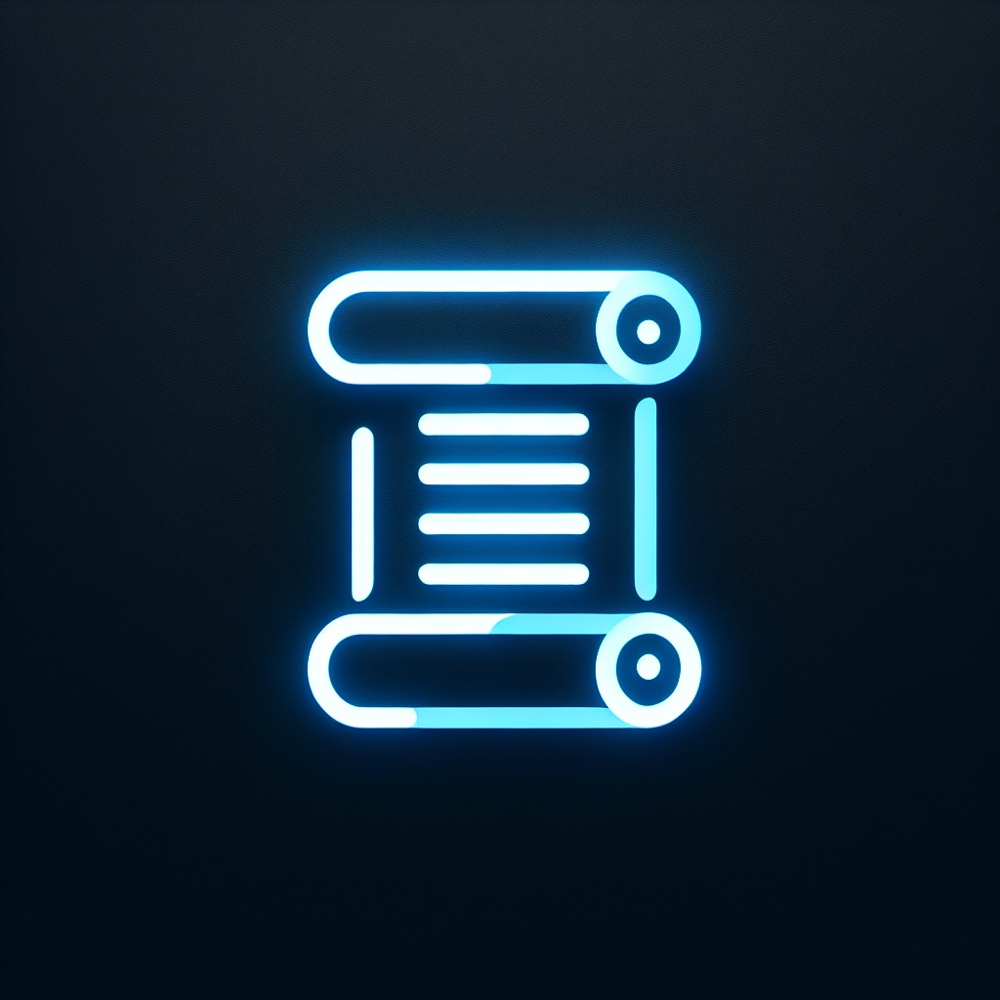

# Greek Polytonic Keyboard for iOS

A custom iOS keyboard extension that provides full polytonic Greek support for ancient and Koine Greek texts. This keyboard allows users to access all necessary diacritical marks and breathing marks through an intuitive long-press interface.

## Features

- Complete polytonic Greek character set with all breathing and accent combinations
- Intelligent learning algorithm that remembers commonly used polytonic combinations
- Text prediction specific to ancient Greek
- User-friendly interface with long-press popups for accessing diacritical marks
- Compatible with all iOS apps that support custom keyboards
- Built following iOS keyboard extension guidelines

## Screenshots



## Requirements

- iOS 14.0+
- Xcode 13.0+
- Swift 5.0+

## Installation

### From GitHub

1. Clone this repository:
   ```
   git clone https://github.com/yourusername/GreekPolytonicKeyboard.git
   ```

2. Open the project in Xcode:
   ```
   cd GreekPolytonicKeyboard
   open GreekPolytonicKeyboard.xcodeproj
   ```

3. Build and run the app on your device or simulator.

### For End Users

1. Download the "Greek Polytonic Keyboard" app from the App Store (coming soon)
2. Follow the in-app instructions to enable the keyboard in iOS Settings

## Enabling the Keyboard

After installing the app:

1. Open Settings on your iOS device
2. Navigate to General > Keyboard > Keyboards
3. Tap "Add New Keyboard..."
4. Select "Greek Polytonic Keyboard" from the list
5. Toggle "Allow Full Access" if you want to enable extra features (optional)
6. When typing in any app, tap the globe icon 🌐 to switch to the Greek Polytonic Keyboard

## Using the Keyboard

- Tap a letter key to type the basic character
- Long-press on vowels (α, ε, η, ι, ο, υ, ω) to display polytonic variations with breathing marks and accents
- Slide to the desired character in the popup and release to select it
- The keyboard learns your most commonly used combinations and will prioritize displaying those

## Technical Details

The keyboard consists of two main components:

1. **GreekPolytonicKeyboardApp**: The container app that includes instructions and a testing area
2. **GreekPolytonicKeyboard**: The actual keyboard extension that iOS loads

Key technical components:

- `KeyboardViewController.swift`: Main controller for the keyboard extension
- `KeyboardView.swift`: Visual layout and handling of the keyboard
- `GreekCharacterProvider.swift`: Manages polytonic Greek character sets
- `GreekTextPredictor.swift`: Handles text prediction and learning algorithms

## Building From Source

1. Ensure you have Xcode installed
2. Clone the repository
3. Open the project in Xcode
4. Select the appropriate target (either the main app or keyboard extension)
5. Build and run on your device or simulator

## Contributing

Contributions are welcome! If you'd like to contribute:

1. Fork the repository
2. Create a feature branch (`git checkout -b feature/amazing-feature`)
3. Make your changes
4. Commit your changes (`git commit -m 'Add amazing feature'`)
5. Push to the branch (`git push origin feature/amazing-feature`)
6. Open a Pull Request

## License

This project is licensed under the MIT License - see the LICENSE file for details.

## Acknowledgments

- Special thanks to all polytonic Greek scholars and students who provided feedback
- Inspired by the need for better ancient Greek input methods on iOS